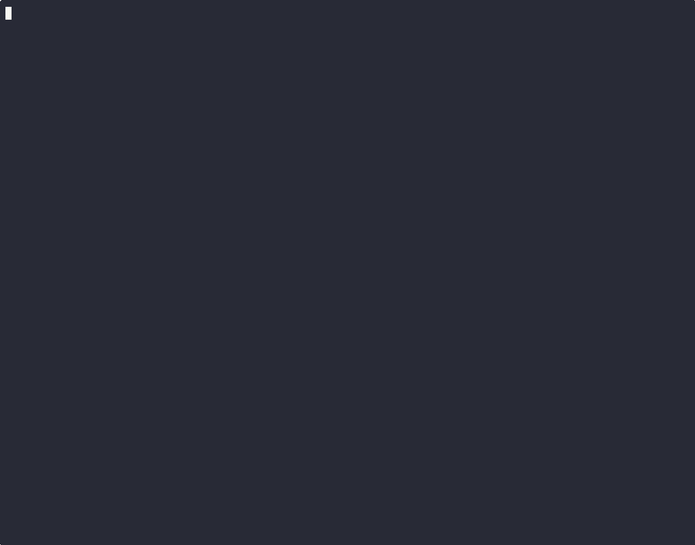

# Neptune DXP on SAP BTP

Welcome to the Neptune DXP on SAP BTP repository!

This repository contains scrips for easy deployment on the Neptune DXP - Open Edition Docker container on SAP BTP Cloud Foundry.

The manual steps for deployment of Neptune DXP - Open Edition are described in our documentation here: https://docs.neptune-software.com/neptune-dxp-open-edition/24/installation-guide/install-neptune-dxp-open-edition-on-btp-with-postgreSQL.html#_postgresql_hyperscaler_option

This setup includes a lot of manual steps and also enabeling ssh tunnels via the Cloud Foundry cli, including using Database tools (psql, DBeaver, or others) I have worked on making the deployment process easier and faster by scripting the complete setup.

Pre-requisites

- SAP BTP Subaccount (BTP Trial or BTP Free Tier or BTP Production)
  A BTP Trail account can be created here https://www.sap.com/products/technology-platform/trial.html
- Postgresql instance running in subaccount
  Checkout our documenation on how to create a Postgresql instance on your subaccount
  https://docs.neptune-software.com/neptune-dxp-open-edition/24/installation-guide/install-neptune-dxp-open-edition-on-btp-with-postgreSQL.html#_postgresql_hyperscaler_option
- Cloud Foundry CLI v8 or higher
  Installation Guide here https://github.com/cloudfoundry/cli/wiki/V8-CLI-Installation-Guide
- NodeJS to run the npm scripts

The main setup script is a NodeJS application running locally which executes the Cloud Foundry CLI commands by using ShellJS a JavaScript library to run shell command from NodeJS 🚀

A couple of commands which are included are:

- `cf services` to check which services are running in the SAP BTP subaccount
- `cf push` to deploy the `pg-init` application and the Neptune DXP `planet9` docker container
- `cf env` to read environment variables of a deployed application
- `cf restage` to restart an application after changes

Included is also another NodeJS application `pg-init` which will be deployed to SAP BTP, this application reads the Postgres Service binding environment variables and connects to the Postgres Database and will execute the `CREATE SCHEMA IF NOT EXISTS planet9;` SQL command to create the `planet9` schema which is needed for running Neptune DXP - Open Edition.

## Use the script

Make sure you have the CF cli and NodeJS installed locally.

Clone this repository to your local pc

```
git clone https://github.com/neptune-software/neptune-dxp-on-btp
```

To run the main script, make sure you are logged in to the SAP BTP subaccount and space wherre you want to deploy Neptune. For a Trial account this will be the `dev` space.

You can login with your email address of your S-User

```
cf login -u <email-address>
```

or use the `--sso` option to login via the browser with a temporary authentication code

```
cf login -u <email-address> --sso
```

Start the script

```
npm run start
```

Here is an asciinema recording of the script, when all prerequisites are met you can install Neptune DXP - Open Edition in just under 2 minutes 🚀



> [!NOTE]
> The scripts have been tested on MacOS and Linux using the latest Cloud Foundry CLI.

Please open a GitHub Issue in this repository if you encounter any problems.
